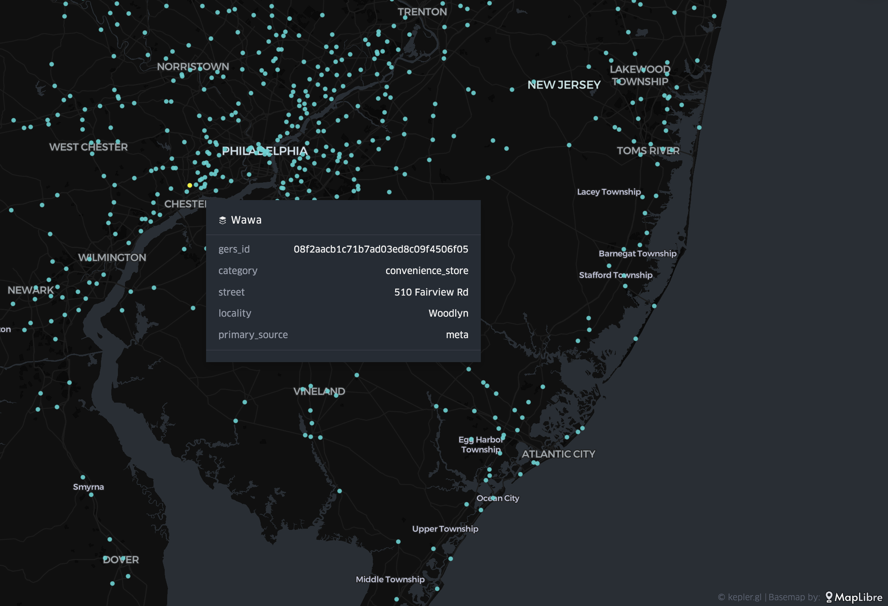

### Overture places in five minutes

([Wait, what is Overture?](https://docs.overturemaps.org/))

1. Check out the Overture [places guide](https://docs.overturemaps.org/guides/places/) for an overview of the data and schema.
2. [Install and set up DuckDB](https://docs.overturemaps.org/getting-data/duckdb/).
3. Get the [bounding box](https://boundingbox.klokantech.com/) for your area of interest.
4. Query the Overture places theme to get just the data you want, from the cloud to your desktop in 30 seconds:

```sql
LOAD spatial; 
LOAD httpfs;  
-- Access the data on AWS in this example
SET s3_region='us-west-2';

COPY (SELECT
      id as gers_id,
      categories.primary AS category,
      addresses[1].freeform as street,
      addresses[1].locality as city,
      sources[1].dataset as primary_source,
      geometry -- Thanks DuckDB 1.1.0!
  FROM read_parquet('s3://overturemaps-us-west-2/release/2024-10-23.0/theme=places/*/*', filename=true, hive_partitioning=1)
  WHERE
      names.primary LIKE 'Wawa' -- waaaah waaaah
     AND  bbox.xmin BETWEEN -77.51 AND -73.2
     AND bbox.ymin BETWEEN 38.87 AND 41.45)
     TO 'wawa-places-philly-nj.geojson' WITH (FORMAT GDAL, DRIVER 'GeoJSON', SRS 'EPSG:4326');
```
5. Drag the GeoJSON file to [kepler.gl](https://kepler.gl/). Style and visualize. 

|  |
|:--:|
| *Philly <3 Wawa* |
